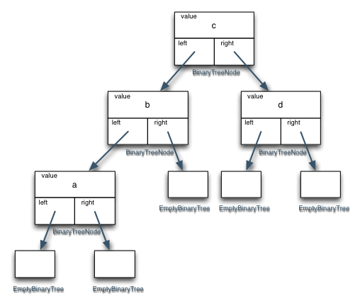

# Functional Binary Trees
In this kata, you will create an immutable, unbalanced, binary tree. If you have not yet completed the [Functional Lists](http://www.codewars.com/dojo/katas/527bbf9f8699010bf40006ee) kata, I would recommend doing that first.

Most tree implementations use mutable nodes. Mutability brings with it a whole host of problems (especially in threaded environments, but even just with state saved and shared in multiple places). When you shift to immutable nodes, you gain a new ability to reason about things. If you have a tree, it will never contain different things or have a different structure than it does at the moment.

However, when dealing with immutable nodes, one has to take special steps to try to maintain efficiency. For example, to insert a node into a tree, one needs to create new nodes the whole way down to the insertion point, but one needn't create any more nodes than there are on the path from the root of the tree to the inserted node.

In some binary search tree implementations, one stores a value with a given key. The key is used to decide where to place the item in the tree and where to look for the item in the tree. In this kata, we will only be concerned with a tree where the value also serves as the key. All values added to the tree will be (usefully) comparable with `<` to all other values placed in the same tree. If you are at a node `n` and you are looking for a value that is less than `n.value`, then you should only need to look in the `n.left` subtree.

There are two classes involved here: `EmptyBinaryTree` and `BinaryTreeNode`. Each of these should support the following operations: `isEmpty()`, `depth()`, `count()`, `inorder()`, `preorder()`, `postorder()`, `contains()`, `insert()`, and `remove()`.

```js
var tree0 = new EmptyBinaryTree();
var tree1 = tree0.insert('c');
var tree2 = tree1.insert('b');
var tree3 = tree2.insert('d');
var tree4 = tree3.insert('a');
```

Diagramatically, this is what `tree4` above should look like (though in reality, the `EmptyBinaryTree` boxes needn't all be distinct):



Or, if you prefer JSON:
```js
{ value: 'c',
  left: { value: 'b',
          left: { value: 'a',
                  left: {},
                  right: {} },
          right: {} },
  right: { value: 'd',
           left: {},
           right: {} } }
```

The constructors for all of the classes are completed for you.

The `isEmpty()` method should return `true` for `EmptyBinaryTree` instances and `false` for `BinaryTreeNode` instances.

The `depth()` method should return the maximum number of nodes one would need to visit to get from the current node to an empty node. In the above diagram, the depth at the 'c' node would be 3. The `depth` at the 'd' node would be 1.

The `count()` method should return the number of non-empty nodes in the tree.

The `inorder(fn)`, `preorder(fn)`, and `postorder(fn)` methods each call the given function `fn` with every value in the tree. The `inorder(fn)` should do the left subtree before calling `fn` for the current value and then do the right subtree. The `preorder(fn)` should call `fn` for the current value then do the left subtree and then do the right subtree. The `postorder(fn)` should do the left subtree then the right subtree and then call `fn` for the current value.

The `contains(x)` function should return whether the given tree contains a node whose value is `x`. Note: this should not have to look at every node in the tree to decide.

The `insert(x)` function returns a new tree that contains a new node with value `x`. If there is already a node containing `x`, this should still add another one, but it doesn't matter whether it is right or left of the existing one (or even if you just use a repeat-count in the `BinaryTreeNode`). Note: there are several ways one could write this function. For this kata, if the tree is non-empty, then inserting a new value should result in a tree with the same root value as the previous tree. With the above examples, this means:
```js
tree4.value === tree3.value
  && tree3.value === tree2.value
  && tree2.value === tree1.value
  && tree1.value == 'c'
```

Also note that (subject to the above restriction) this function must share as much of the original tree as possible with the new tree. That means that `tree4.left` should be the same as `tree3.left`.

The `remove(x)` method should remove one node with value `x` from the tree. Note: this is different than the Functional List kata where `remove(x)` got rid of all values of `x` from the list. Again, this function should share as much of the original tree as possible. This means that `tree4.remove('d').left` should be the same as `tree4.left`.

Warning
I added some tests to ensure that when `insert(x)` and `remove(x)` and `contains(x)` are called that you only work on the relevant portion of the tree. If you go down the wrong tree on these test cases, you could potentially loop forever (until the Code timeout kills you). Because of the way that I crafted these test cases, you also need to make sure that you wrote `depth()` and `count()` recursively rather than somehow using the traversal methods: `inorder()`, `preorder()`, `postorder()`, or iteratively walking left and right.