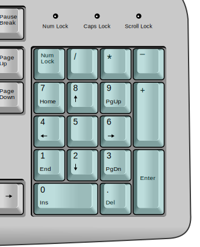
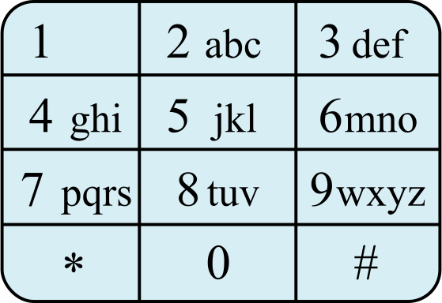

# Keypad horror

Having two standards for a keypad layout is inconvenient!  
Computer keypad's layout:  

Cell phone keypad's layout:  

Solve the horror of un-standardized keypads by providing a function that converts computer input to a number as if it was typed on a phone.

Example:  
"789" -> "123"  

Notes:  
You get a string with numbers only
