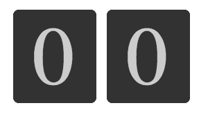

# Flip Counter

Build a flip counter that counts a minute (0-59) iteratively.

If you can, try and minimize the creation of new DOM elements in runtime, by reusing the same elements.

*Example:*

When you feel ready, you can validate your solution using any collaborative HTML/CSS renderer, such as [this one](https://codepen.io/pen/?editors=1000).

Hints

- ask your peer if they can think of a way to avoid creating new DOM elements
- ask your peer to describe how they might achieve the flip effect, prior to actually writing the code
- suggest to have separate “up” and “down” elements for each digit component, to achieve the flip transition

 

Answer

[Here’s](https://codepen.io/prampcontent/pen/OoLBrp) a working implementation for reference (using some basic `jquery` to reduce code bloat).

Important points to notice:

- all the digits are available in the markup, and are re-used in place.
- note the usage of the same basic `count` function for both the `ones` and the `tens` digits.
- we’re using the `z-index` property to show the currently active digit.
- we’re using the `:first-child` and `:last-child` attributes to handle the first and last digit.
- we’re defining custom animations to transition between the `z-index` as well as to perform the actual transformation.

